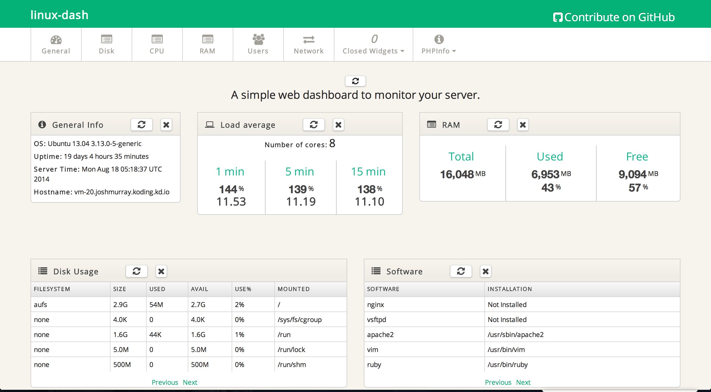

# Installing Linux Dash

Linux Dash is a low-overhead monitoring web dashboard for a GNU/Linux 
machine. With a dead-simple installation and easy to view information, it 
can make viewing an overview of your Linux system a beginner friendly 
endevour. In this guide we'll go over this two step install process on 
Koding. Lets get started!

## Installation

To install dash we simply need download linux-dash from source, and then 
place it into an Apache directory. To do this, run the following 
commands. Note, you can simply copy the entire group of commands and 
paste it into your Terminal. They will execute sequentially.

```
wget https://github.com/afaqurk/linux-dash/archive/master.zip
unzip master.zip
rm master.zip
mv linux-dash-master ~/Web/dash
```

That's it! Dash uses PHP, which means there is no traditional 
installation process. We only need a few things, all of which Koding 
comes with by default!

## Dashboard

To access your dashboard, visit your Koding Domain, which will look like 
the following address.

```
http://username.kd.io
```

Where `username` is your Koding Username. You will see a Dashboard, 
similar to the following image.



That's all there is to it! Enjoy!


[dash]: linuxdash.com
